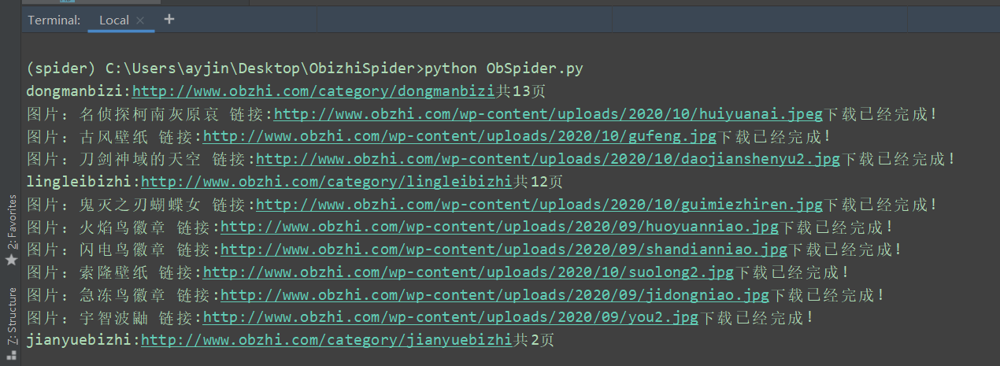
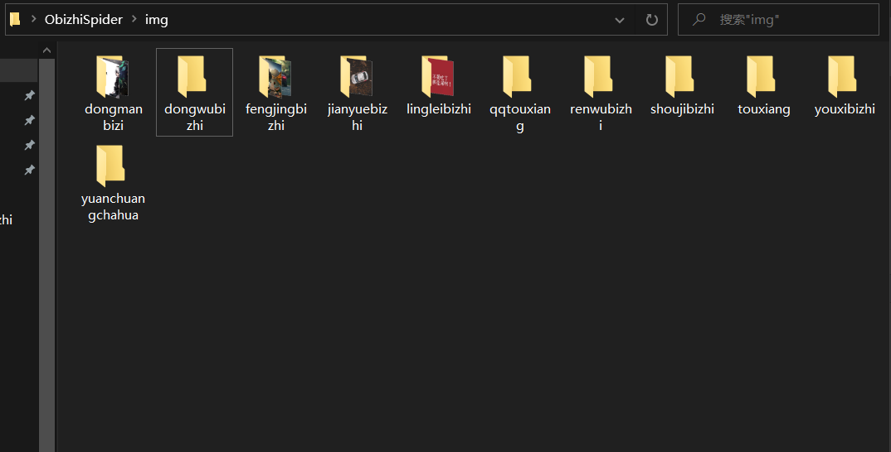

# [多进程爬虫使用说明](https://github.com/ay1Jin/ObizhiSpider)
### 简介

这是一个使用原生Requests库和Multiprocessing库完成的爬虫，爬取网址为http://www.obzhi.com/

### 使用说明

[使用文档](https://github.com/ay1Jin/ObizhiSpider/blob/main/README.md)

1.首先下载该代码，可以选择压缩包或者命令行输入以下指令
```
$ git clone https://github.com/ay1Jin/ObizhiSpider.git
```
2.安装依赖，这里默认使用的python3.6
```
$ pip install -r requirement.txt
```
3.在根目录创建一个img文件夹
```
$ python ObSpider.py
```
接下来就可以看到抓取的日志了。

### 使用截图

### 最后
谢谢使用~有问题可提交[Issues](https://github.com/ay1Jin/ObizhiSpider/issues)